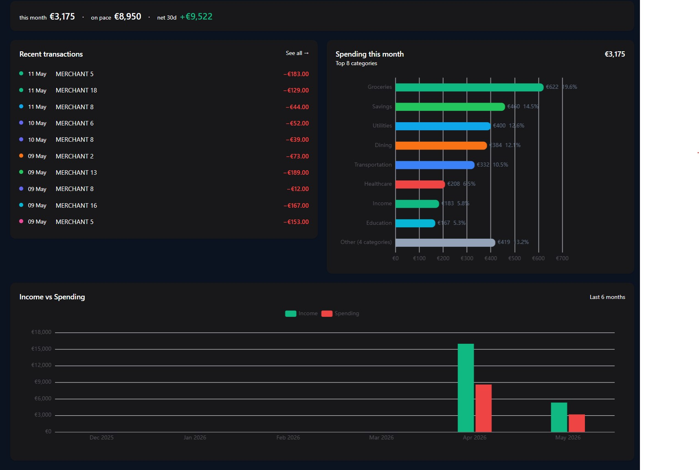
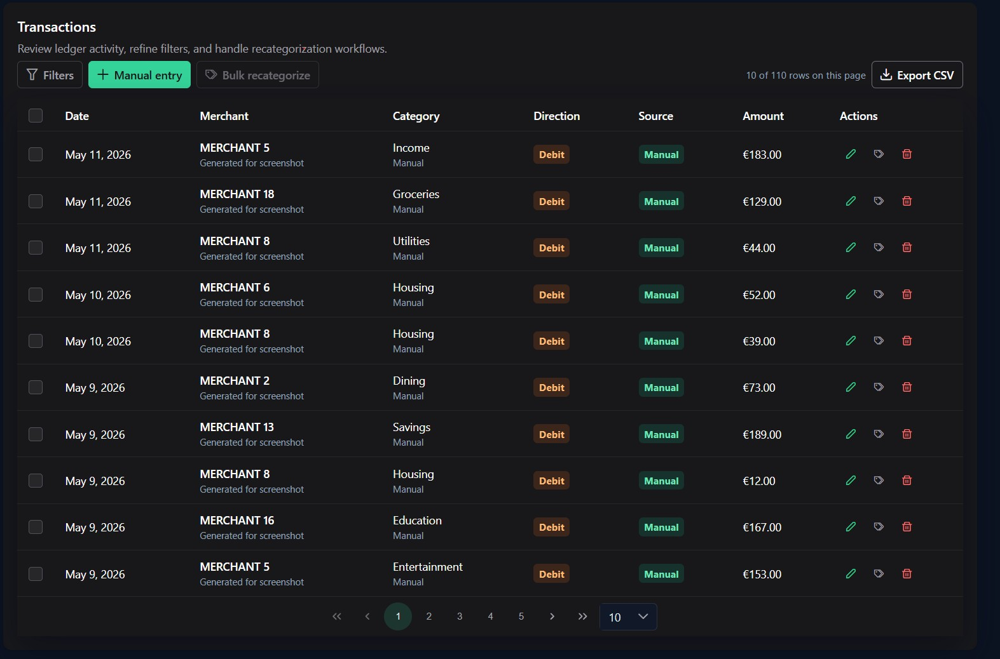
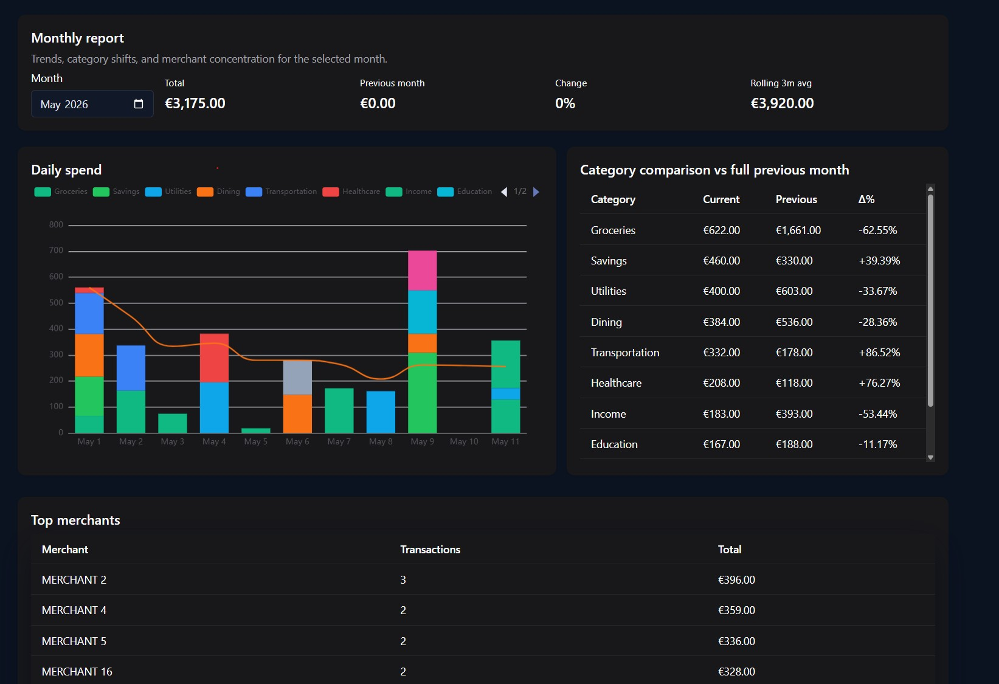
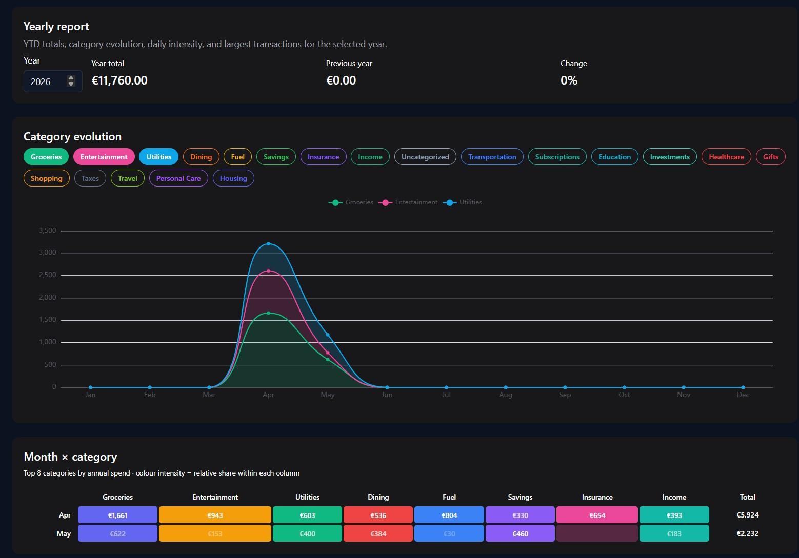

# ExpenseTracker

A self-hosted personal finance platform with AI-powered transaction categorization, investment portfolio tracking (Interactive Brokers integration), and intelligent dashboard narratives.

---

## Table of Contents

- [Overview](#overview)
- [Screenshots](#screenshots)
- [Architecture](#architecture)
- [Backend (API)](#backend-api)
- [Frontend (Client)](#frontend-client)
- [Hosting & Deployment](#hosting--deployment)
- [Configuration Reference](#configuration-reference)
- [Default User & First Login](#default-user--first-login)
- [SMS Forwarding Setup](#sms-forwarding-setup)
- [Development Setup](#development-setup)
- [Project Structure](#project-structure)
- [Implementing a Custom Bank Parser](#implementing-a-custom-bank-parser)

---

## Overview

ExpenseTracker is a full-stack financial application built with:

| Layer | Technology | Purpose |
|-------|-----------|---------|
| **Frontend** | Angular 19 + PrimeNG | SPA dashboard, charts, data management |
| **Backend** | .NET 10 / ASP.NET Core | REST API, background workers, LLM integration |
| **Database** | PostgreSQL 17 | Persistent storage (EF Core, snake_case) |
| **AI/LLM** | OpenAI / Anthropic / Gemini | Auto-categorization & narrative generation |
| **Investments** | IBKR Flex Queries | Portfolio sync, positions, trades |
| **Logging** | Serilog | Structured logs to files (rolling daily) |

**Key Features:**
- SMS webhook ingestion → automatic transaction creation & categorization
- Multi-provider LLM categorization with merchant rule learning
- Investment portfolio tracking (IBKR + manual accounts)
- AI-generated dashboard narratives (daily, monthly, yearly)
- Multi-user with admin panel
- CSV export, audit logging, rate limiting

---

## Screenshots






---

## Architecture

### High-Level System Diagram

```
┌─────────────────────────────────────────────────────────────────────┐
│                         REVERSE PROXY (nginx)                        │
│                    (TLS termination, routing)                         │
└────────────┬─────────────────────────────────┬──────────────────────┘
             │                                 │
             ▼                                 ▼
┌────────────────────────┐       ┌────────────────────────────────────┐
│   FRONTEND (Angular)   │       │         BACKEND (.NET API)          │
│                        │       │                                      │
│  • PrimeNG UI          │──────▶│  Controllers ──▶ Application Layer  │
│  • ECharts dashboards  │ /api/ │       │              │               │
│  • JWT auth            │       │       ▼              ▼               │
│  • Signals state       │       │  Middleware    Services (biz logic)  │
│                        │       │       │              │               │
│  nginx serves static   │       │       ▼              ▼               │
│  + proxies /api/       │       │  Background    Infrastructure       │
└────────────────────────┘       │  Workers        (EF Core, LLM)      │
                                 └───────────┬────────────────────┬────┘
                                             │                    │
                                             ▼                    ▼
                                 ┌──────────────────┐  ┌──────────────────┐
                                 │  PostgreSQL 17   │  │  External APIs   │
                                 │  (persistent)    │  │  • OpenAI        │
                                 │                  │  │  • Anthropic     │
                                 │  18 tables       │  │  • Gemini        │
                                 │  snake_case      │  │  • IBKR Flex     │
                                 └──────────────────┘  └──────────────────┘
```

### Backend Layer Architecture

```
┌─────────────────────────────────────────────────────────────────┐
│                      ExpenseTracker.Api                           │
│  Controllers, Middleware, Background Services, DI Configuration  │
└──────────────────────────────┬──────────────────────────────────┘
                               │ depends on
                               ▼
┌─────────────────────────────────────────────────────────────────┐
│                   ExpenseTracker.Application                      │
│  Service interfaces & implementations, DTOs, Business logic      │
└──────────────────────────────┬──────────────────────────────────┘
                               │ depends on
                               ▼
┌─────────────────────────────────────────────────────────────────┐
│                      ExpenseTracker.Core                          │
│  Entities, Enums, Interfaces (repository contracts, provider     │
│  abstractions), Records, Domain models                           │
└─────────────────────────────────────────────────────────────────┘
                               ▲
                               │ implements
┌─────────────────────────────────────────────────────────────────┐
│                  ExpenseTracker.Infrastructure                    │
│  EF Core DbContext, Repositories, LLM Providers (OpenAI,        │
│  Anthropic, Gemini), IBKR Integration, SeedData, JWT Service     │
└─────────────────────────────────────────────────────────────────┘
```

### Data Flow: SMS → Transaction

```
              ┌────────────┐
  Phone SMS   │  Tasker /  │   HTTP POST /api/webhooks/sms
  arrives ───▶│  Automation│──────────────────────────────┐
              └────────────┘                              │
                                                          ▼
                                              ┌──────────────────────┐
                                              │  WebhookController   │
                                              │  (rate-limited 60/m) │
                                              └──────────┬───────────┘
                                                         │
                                                         ▼
                                              ┌──────────────────────┐
                                              │  WebhookService      │
                                              │  • Auth by secret    │
                                              │  • Dedup by hash     │
                                              │  • Queue to channel  │
                                              └──────────┬───────────┘
                                                         │
                                                         ▼
                                              ┌──────────────────────┐
                                              │  SmsProcessing       │
                                              │  BackgroundService   │
                                              │  • Parse SMS body    │
                                              │  • Resolve category: │
                                              │    1. Merchant rule   │
                                              │    2. LLM fallback   │
                                              │    3. "Uncategorized" │
                                              │  • Create transaction│
                                              │  • Create rule if    │
                                              │    LLM confident     │
                                              └──────────────────────┘
```

### Frontend Component Architecture

```
┌─────────────────────────────────────────────────────────┐
│                    App Shell (Sidebar + Router)           │
├─────────────────────────────────────────────────────────┤
│                                                          │
│  ┌─────────────┐  ┌──────────────┐  ┌──────────────┐   │
│  │  Dashboard  │  │ Transactions │  │  Investments │   │
│  │  • Strip    │  │  • List      │  │  • Summary   │   │
│  │  • Charts   │  │  • Filters   │  │  • Holdings  │   │
│  │  • Narrative│  │  • Dialog    │  │  • History   │   │
│  │  • Leaders  │  │  • Recat.    │  │  • Manual    │   │
│  └─────────────┘  └──────────────┘  └──────────────┘   │
│                                                          │
│  ┌─────────────┐  ┌──────────────┐  ┌──────────────┐   │
│  │  Reports    │  │  Settings    │  │   Admin      │   │
│  │  • Monthly  │  │  • Account   │  │  • Users     │   │
│  │  • Yearly   │  │  • LLM      │  │  • Create    │   │
│  │  • Insights │  │  • Webhook  │  │  • Delete    │   │
│  └─────────────┘  │  • Invest.  │  └──────────────┘   │
│                    └──────────────┘                      │
├─────────────────────────────────────────────────────────┤
│              Core Services & Interceptors                 │
│  AuthService ─ ApiService ─ AuthInterceptor ─ Guards     │
└─────────────────────────────────────────────────────────┘
```

---

## Backend (API)

### Technology Stack

- **.NET 10** / ASP.NET Core (minimal hosting, top-level statements)
- **Entity Framework Core** with Npgsql (PostgreSQL)
- **Serilog** for structured logging (console + rolling file sinks)
- **JWT Bearer** authentication with refresh tokens
- **Data Protection API** for encrypting secrets at rest
- **Channel\<T\>** based background processing queues
- **HttpClientFactory** with named clients for LLM providers

### Key Concepts

| Concept | Implementation |
|---------|---------------|
| **Auth** | JWT (HMAC-SHA256, 1h expiry) + refresh tokens (30d) |
| **Multi-user** | All data scoped by `UserId`; first seeded user = admin |
| **LLM** | Pluggable providers via `ILlmCategorizationProvider` / `ILlmNarrativeProvider` |
| **Investments** | IBKR Flex Query XML reports + manual balance input |
| **SMS Parsing** | Extensible bank SMS parser (OTP Banka included as reference) |
| **Background** | 4 hosted services: SMS processor, Investment sync, Daily narrative, On-demand narrative |
| **Audit** | `AuditLog` table tracks entity changes; `LlmCallLog` tracks all AI calls |
| **Soft Delete** | Transactions use `IsDeleted` flag |
| **Caching** | `IMemoryCache` for active LLM provider (60s TTL) |
| **Rate Limits** | Login: 5/15min per IP; Webhook: 60/1min per IP |

### API Endpoints

| Route | Methods | Auth | Description |
|-------|---------|------|-------------|
| `/api/auth/login` | POST | Public | Authenticate, get JWT |
| `/api/auth/refresh` | POST | Public | Refresh access token |
| `/api/auth/logout` | POST | Bearer | Revoke refresh token |
| `/api/auth/change-password` | POST | Bearer | Update password |
| `/api/transactions` | GET, POST | Bearer | List (paginated), create |
| `/api/transactions/{id}` | GET, PATCH, DELETE | Bearer | Read, update, soft-delete |
| `/api/transactions/{id}/recategorize` | POST | Bearer | Re-assign category |
| `/api/transactions/bulk-recategorize` | POST | Bearer | Bulk category update |
| `/api/transactions/export` | GET | Bearer | CSV download |
| `/api/categories` | GET, POST | Bearer | List, create |
| `/api/categories/{id}` | PATCH, DELETE | Bearer | Update, delete |
| `/api/merchant-rules` | GET | Bearer | List merchant rules |
| `/api/merchant-rules/{id}` | PATCH, DELETE | Bearer | Update, delete rule |
| `/api/analytics/dashboard` | GET | Bearer | Dashboard analytics |
| `/api/analytics/dashboard/strip` | GET | Bearer | Top-line metrics |
| `/api/analytics/monthly` | GET | Bearer | Monthly breakdown |
| `/api/analytics/yearly` | GET | Bearer | Yearly breakdown |
| `/api/analytics/insights` | GET | Bearer | AI insights + narrative |
| `/api/investments/summary` | GET | Bearer | Portfolio summary |
| `/api/investments/holdings` | GET | Bearer | Current positions |
| `/api/investments/history` | GET | Bearer | Portfolio value over time |
| `/api/investments/sync` | POST | Bearer | Trigger manual sync |
| `/api/investment-providers` | GET | Bearer | List providers |
| `/api/investment-providers/{id}` | PATCH | Bearer | Configure provider |
| `/api/investment-providers/{id}/test` | POST | Bearer | Test connection |
| `/api/llm-providers` | GET | Bearer | List LLM providers |
| `/api/llm-providers/{id}` | PATCH | Bearer | Configure provider |
| `/api/llm-providers/{id}/test` | POST | Bearer | Test LLM connection |
| `/api/settings` | GET, PATCH | Bearer | User settings |
| `/api/webhooks/sms` | POST | Secret header | Ingest SMS messages |
| `/api/admin/users` | GET, POST | Admin | List, create users |
| `/api/admin/users/{id}` | DELETE | Admin | Delete user |

### Background Services

| Service | Schedule | Purpose |
|---------|----------|---------|
| `SmsProcessingBackgroundService` | Channel-driven (real-time) | Parse SMS → create transactions |
| `InvestmentSyncWorker` | Daily at 23:00 UTC | Sync IBKR positions & trades |
| `DailyNarrativeWorker` | Daily at 06:00 UTC | Regenerate AI narratives for all users |
| `NarrativeRegenerationWorker` | Channel-driven (on-demand) | Regenerate specific narrative on request |

### Database Schema (Key Tables)

```
users ─────────────────┐
  │                    │
  ├── transactions     │── categories (hierarchical, user-scoped)
  │     └── raw_messages (SMS source)
  │
  ├── merchant_rules (merchant → category mapping)
  │
  ├── llm_providers (OpenAI/Anthropic/Gemini config)
  │     └── llm_call_logs (audit all AI calls)
  │
  ├── investment_providers (IBKR/Manual config)
  │     └── investment_accounts
  │           ├── holdings (current positions)
  │           ├── investment_transactions (trades)
  │           └── portfolio_history (daily snapshots)
  │
  ├── summaries (cached AI narratives)
  ├── settings (key-value per user)
  └── audit_logs (change tracking)
```

---

## Frontend (Client)

### Technology Stack

- **Angular 19.2** (standalone components, signals, lazy loading)
- **PrimeNG 19** (UI component library)
- **PrimeFlex 4** (CSS utility framework)
- **ECharts** via ngx-echarts (data visualizations)
- **RxJS 7.8** (reactive data streams)

### Key Patterns

| Pattern | Usage |
|---------|-------|
| **Standalone Components** | No NgModules; each component declares its own imports |
| **Angular Signals** | Primary state management (auth, currency, UI) |
| **Reactive Forms** | All forms use FormBuilder/FormGroup |
| **Lazy Loading** | Routes use `loadComponent` for code splitting |
| **Interceptors** | `AuthInterceptor` (token injection) + `ErrorInterceptor` (toast notifications) |
| **Guards** | `authGuard` (login check) + `adminGuard` (role check) |
| **Context Tokens** | `SKIP_AUTH_CONTEXT`, `SKIP_ERROR_TOAST_CONTEXT` for interceptor control |
| **Runtime Config** | `env.js` injected at deploy time for API URL |

### Service Architecture

```
Components (pages)
      │
      ▼
Domain Services (thin wrappers)
  • TransactionService, CategoryService, InvestmentService, etc.
      │
      ▼
ApiService (centralized HTTP client)
  • ~50+ methods covering all endpoints
  • localStorage caching for offline fallback
  • Typed request/response models
      │
      ▼
HttpClient + Interceptors
  • AuthInterceptor: attach Bearer token, handle 401 → refresh
  • ErrorInterceptor: show PrimeNG toast on errors
```

### Routing Overview

| Route | Guard | Component |
|-------|-------|-----------|
| `/login` | None | LoginComponent |
| `/dashboard` | auth | DashboardComponent |
| `/transactions` | auth | TransactionsComponent |
| `/categories` | auth | CategoriesComponent |
| `/rules` | auth | MerchantRulesComponent |
| `/reports/monthly` | auth | MonthlyReportComponent |
| `/reports/yearly` | auth | YearlyReportComponent |
| `/reports/insights` | auth | InsightsComponent |
| `/investments` | auth | InvestmentsComponent |
| `/settings/*` | auth | Settings sub-pages |
| `/admin/users` | admin | UserManagementComponent |
| `/queue` | auth | QueueComponent |
| `/parse-failures` | auth | ParseFailuresComponent |

### Theming & Dark Mode

- **PrimeNG Aura** theme with dark mode toggle
- Dark mode persisted in `localStorage`
- CSS class `.app-dark` on body activates dark styles

---

## Hosting & Deployment

### Docker Compose (Recommended)

The simplest way to deploy is via Docker Compose:

**1. Create a `.env` file** in the repo root (copy from `.env.example`):

```env
# Required
POSTGRES_PASSWORD=your-secure-db-password
JWT_SECRET=your-random-string-at-least-32-characters-long

# Optional
INITIAL_USERNAME=admin
INITIAL_PASSWORD=YourFirstLoginPassword123
FRONTEND_ORIGIN=https://expenses.yourdomain.com
ASPNETCORE_ENVIRONMENT=Production
```

**2. Run:**

```bash
docker compose up -d
```

This starts:
- **PostgreSQL 17** on internal network (not exposed)
- **API** on `127.0.0.1:8082` (internal only, configurable via `API_PORT`)
- **Frontend (nginx)** on `127.0.0.1:4200` (serves SPA + proxies `/api/`, configurable via `FRONTEND_PORT`)

**3. Reverse proxy** (nginx/Caddy/Traefik):

Point your domain to the frontend container (port 4200). The frontend's nginx config already proxies `/api/` requests to the backend.

Example Caddy config:
```
expenses.yourdomain.com {
    reverse_proxy localhost:4200
}
```

### Architecture in Production

```
Internet → Reverse Proxy (TLS) → Frontend nginx (:4200)
                                      │
                                      ├── Static files (Angular SPA)
                                      └── /api/* → Backend API (:8080)
                                                        │
                                                        └── PostgreSQL (:5432)
```

### Volume Mounts

| Volume | Purpose | Critical? |
|--------|---------|-----------|
| `pgdata` | PostgreSQL database files | **Yes** - back this up |
| `dpkeys` | ASP.NET Data Protection keys (encrypts API keys) | **Yes** - loss = re-enter all API keys |

### Manual Deployment (without Docker)

1. **Database**: Install PostgreSQL 17, create database `expensetracker`
2. **Backend**:
   ```bash
   cd src/ExpenseTracker.Api
   dotnet publish -c Release -o ./publish
   # Set environment variables (see Configuration Reference)
   cd publish && dotnet ExpenseTracker.Api.dll
   ```
3. **Frontend**:
   ```bash
   cd expensetracker.client
   npm ci && npx ng build --configuration=production
   # Serve dist/expensetracker.client/browser/ with nginx/Apache
   # Configure /api/ proxy to backend
   ```

---

## Configuration Reference

### Environment Variables (Backend)

| Variable | Required | Default | Description |
|----------|----------|---------|-------------|
| `DB_CONNECTION_STRING` | Yes | — | PostgreSQL connection string |
| `JWT_SECRET` | Yes (prod) | dev placeholder | HMAC key for JWT signing (min 32 chars) |
| `INITIAL_USERNAME` | No | `admin` | Username for the auto-created admin user |
| `INITIAL_PASSWORD` | No | `ChangeMeNow!` | Password for the auto-created admin user |
| `FRONTEND_ORIGIN` | No | `http://localhost:4200` | CORS allowed origin |
| `ASPNETCORE_ENVIRONMENT` | No | `Production` | Runtime environment |
| `DATA_PROTECTION_KEY_PATH` | No | `./data-protection-keys` | Path to persist encryption keys |
| `POSTGRES_PASSWORD` | Yes (compose) | — | Database password (docker-compose) |
| `API_PORT` | No | `127.0.0.1:8082` | Host port binding for the API (docker-compose) |
| `FRONTEND_PORT` | No | `127.0.0.1:4200` | Host port binding for the frontend (docker-compose) |

### Frontend Runtime Config

The frontend supports runtime API URL configuration via `env.js`:

```javascript
// Placed at /usr/share/nginx/html/env.js
window.__env = {
  apiBaseUrl: "https://api.yourdomain.com"  // Leave empty if same-origin
};
```

In Docker, this is auto-generated from the `API_BASE_URL` env var.

### Serilog Configuration (appsettings.json)

```jsonc
{
  "Serilog": {
    "MinimumLevel": {
      "Default": "Information",
      "Override": {
        "Microsoft.AspNetCore": "Warning",
        "Microsoft.EntityFrameworkCore": "Warning"
      }
    },
    "WriteTo": [
      { "Name": "Console" },
      { "Name": "File", "Args": {
          "path": "logs/expensetracker-.log",
          "rollingInterval": "Day",
          "retainedFileCountLimit": 30
      }},
      { "Name": "File", "Args": {
          "path": "logs/expensetracker-errors-.log",
          "rollingInterval": "Day",
          "restrictedToMinimumLevel": "Error",
          "retainedFileCountLimit": 60
      }}
    ]
  }
}
```

---

## Default User & First Login

On first startup, the API automatically:

1. **Creates the database schema** (EF Core `EnsureCreatedAsync`)
2. **Runs migrations** (idempotent SQL in `SeedDataService`)
3. **Creates the admin user**:
   - Username: value of `INITIAL_USERNAME` env var (default: `admin`)
   - Password: value of `INITIAL_PASSWORD` env var (default: `ChangeMeNow!`)
   - Role: Admin

### After First Login

1. **Change the default password** immediately (Settings → Account)
2. **Configure LLM provider** (Settings → LLM):
   - Choose OpenAI, Anthropic, or Gemini
   - Enter your API key
   - Select a model
   - Test the connection
3. **Set up SMS webhook** (Settings → Webhook):
   - Generate a webhook secret
   - Configure your phone automation (Tasker/MacroDroid) to POST SMS to:
     ```
     POST https://your-domain/api/webhooks/sms
     Headers: X-Webhook-Secret: <your-secret>
     Body: { "from": "sender", "text": "sms body", "sentStamp": "ISO date" }
     ```
4. **Configure investments** (Settings → Investments):
   - Add IBKR Flex Query credentials, or
   - Use manual accounts for simple balance tracking

### Creating Additional Users

As admin, navigate to Admin → Users → Create User. Each user gets:
- Their own categories (seeded with defaults)
- Their own LLM provider configuration
- Their own investment provider setup
- Isolated transaction data

---

## SMS Forwarding Setup

There are two supported forwarding paths depending on your phone:

| Path | Phone | Method | Reliability |
|---|---|---|---|
| **Android** | Android | SMS Forwarder app | ✅ Best |
| **Mac bridge** | iPhone | Swift script reading chat.db | ✅ Good |
| **iOS Shortcuts** | iPhone (no Mac) | Shortcuts automation | ⚠ Best-effort |

---

### Android Setup

1. Install **[SMS to URL Forwarder](https://f-droid.org/en/packages/tech.bogomolov.incomingsmsgateway/)** from F-Droid (or Google Play: *Incoming SMS Webhook*)

2. Open the app and add a new rule:

   | Field | Value |
   |---|---|
   | Filter | \`OTP\` (matches any sender containing "OTP") |
   | URL | \`https://your-domain.com/api/webhooks/sms\` |
   | Method | POST |

3. Set the request body template:
   \`\`\`json
   {"from":"%from%","text":"%text%","sentStamp":"%sentStamp%"}
   \`\`\`
   > ⚠️ The \`%sentStamp%\` placeholder **must** be wrapped in quotes as shown. Without quotes it sends an unquoted number and the backend will reject it.

4. Add a header:
   \`\`\`
   X-Webhook-Secret: your-webhook-secret
   \`\`\`

5. **Disable battery optimization** for the forwarder app:
   - Settings → Apps → SMS to URL Forwarder → Battery → Unrestricted
   - Also disable "Pause app activity if unused" if present

6. Send a test SMS to your number and verify it appears in the processing queue.

---

### Mac Setup (iPhone via Text Message Forwarding)

The Mac setup involves a Swift binary that polls \`~/Library/Messages/chat.db\` every 2 minutes and forwards new messages to your webhook.

#### Automated install (recommended)

\`\`\`bash
curl -fsSL https://raw.githubusercontent.com/Dominik-cmd/ExpenseTracker/main/scripts/install-mac-forwarder.sh \\
  | bash -s -- \\
    --webhook-url "https://your-domain.com/api/webhooks/sms" \\
    --webhook-secret "your-webhook-secret"
\`\`\`

Or download and run interactively (will prompt for URL and secret):

\`\`\`bash
curl -fsSL https://raw.githubusercontent.com/Dominik-cmd/ExpenseTracker/main/scripts/install-mac-forwarder.sh \\
  -o install-mac-forwarder.sh
chmod +x install-mac-forwarder.sh
./install-mac-forwarder.sh
\`\`\`

The script will:
1. Check prerequisites (Xcode Command Line Tools)
2. Prompt for your webhook URL and secret (if not passed as arguments)
3. Write the Swift forwarder source to \`~/code/sms-forwarder/\`
4. Compile the binary to \`~/bin/sms-forwarder\`
5. Write a config file to \`~/.sms-forwarder.config.json\`
6. Install and load a launchd agent (runs on boot, polls every 120s)
7. Open System Settings to the Full Disk Access pane
8. **Pause for you to grant Full Disk Access** (required — cannot be automated)
9. Run a verification test

#### Full Disk Access (required — manual step)

After the script opens System Settings → Privacy & Security → Full Disk Access:

1. Click the **+** button
2. Navigate to \`~/bin/\` and select \`sms-forwarder\`
3. Toggle it **ON**
4. Press Enter in the terminal to continue

> Without Full Disk Access, the binary cannot read \`chat.db\` and will silently produce no output.

#### iPhone Text Message Forwarding

Enable SMS forwarding from your iPhone to the Mac:

1. On iPhone: Settings → Messages → Text Message Forwarding
2. Toggle on your Mac's name
3. Enter the code shown on your Mac

From this point, all SMS (including bank messages) received on the iPhone will appear in Messages.app on the Mac and be picked up by the forwarder.

#### Verifying the Mac setup

\`\`\`bash
# Check the agent is running
launchctl list | grep sms-forwarder

# Watch the log in real time
tail -f ~/Library/Logs/sms-forwarder.out.log

# Manually trigger a forward run
~/bin/sms-forwarder

# Reset state to re-forward all historical messages
echo '{"lastRowId": 0}' > ~/.sms-forwarder-state.json
~/bin/sms-forwarder
\`\`\`

#### Managing the agent

\`\`\`bash
# Stop
launchctl unload ~/Library/LaunchAgents/com.expense-tracker.sms-forwarder.plist

# Start
launchctl load ~/Library/LaunchAgents/com.expense-tracker.sms-forwarder.plist

# Update webhook URL or secret
nano ~/.sms-forwarder.config.json
# Then reload the agent:
launchctl unload ~/Library/LaunchAgents/com.expense-tracker.sms-forwarder.plist
launchctl load ~/Library/LaunchAgents/com.expense-tracker.sms-forwarder.plist
\`\`\`

#### Multiple iPhones on one Mac

If you need to forward SMS from two iPhones with different Apple IDs to the same Mac:

1. Create a second macOS user account (System Settings → Users & Groups → Add User)
2. Enable Fast User Switching (System Settings → Control Center → Fast User Switching)
3. Log in to the second macOS user and sign into iMessage with the second Apple ID
4. Run the install script again as the second user
5. Keep both users logged in simultaneously via Fast User Switching

Each macOS user runs its own independent forwarder instance with its own \`chat.db\`, config, and state file.

---

### iPhone Only (no Mac) — iOS Shortcuts

If you don't have a Mac, you can use iOS Shortcuts as a best-effort forwarder.

> ⚠️ **Less reliable than the Mac bridge.** Shortcuts may be delayed or skipped if the phone is in low-power mode or has restricted background activity. No historical catch-up if messages are missed.

1. Open **Shortcuts** on iPhone
2. Go to **Automation** → **+** → **New Automation**
3. Trigger: **Message received**
   - From: \`OTP\` (or leave blank and filter in the action)
   - Enable "Run Immediately" (disables the "Run?" prompt)
4. Add actions:
   - **Get Details of Message** → Message Contents + Sender
   - **Get Current Date** → formatted as Unix timestamp
   - **Get Contents of URL**:
     - URL: \`https://your-domain.com/api/webhooks/sms\`
     - Method: POST
     - Headers: \`X-Webhook-Secret: your-secret\`, \`Content-Type: application/json\`
     - Body (JSON):
       \`\`\`json
       {
         "from": "[Sender from step above]",
         "text": "[Message Contents from step above]",
         "sentStamp": "[Timestamp from step above]"
       }
       \`\`\`
5. Save the automation

---

## Development Setup

### Prerequisites

- [.NET 10 SDK](https://dotnet.microsoft.com/download)
- [Node.js 22+](https://nodejs.org/) with npm
- [PostgreSQL 17](https://www.postgresql.org/) (or use Docker)
- (Optional) [Docker & Docker Compose](https://docs.docker.com/get-docker/)

### Quick Start

```bash
# 1. Start PostgreSQL (via Docker or local install)
docker run -d --name pg -e POSTGRES_DB=expensetracker \
  -e POSTGRES_PASSWORD=postgres -p 5432:5432 postgres:17-alpine

# 2. Backend
cd src/ExpenseTracker.Api
dotnet run
# API starts at http://localhost:5197

# 3. Frontend (separate terminal)
cd expensetracker.client
npm install
npx ng serve
# App starts at http://localhost:4200 (proxies /api/ to API)
```

### Build & Test

```bash
# Build entire solution
dotnet build ExpenseTracker.slnx

# Run tests
dotnet test ExpenseTracker.slnx

# Build frontend
cd expensetracker.client && npm run build
```

### Project Dependencies

```
ExpenseTracker.Api
  ├── ExpenseTracker.Application
  │     └── ExpenseTracker.Core
  └── ExpenseTracker.Infrastructure
        ├── ExpenseTracker.Application
        └── ExpenseTracker.Core
```

---

## Project Structure

```
ExpenseTracker/
├── src/
│   ├── ExpenseTracker.Api/            # ASP.NET Core API
│   │   ├── Controllers/               # REST endpoints (14 controllers)
│   │   ├── Middleware/                 # Exception handler, rate limiting, security headers, timing
│   │   ├── Services/                   # Background workers, narrative, diagnostics, investments
│   │   ├── Program.cs                  # App entry point, DI configuration
│   │   ├── appsettings.json           # Serilog + DB config
│   │   └── Dockerfile                  # Multi-stage .NET build
│   │
│   ├── ExpenseTracker.Application/    # Business logic
│   │   ├── Interfaces/                 # Service contracts
│   │   ├── Models/                     # DTOs, request/response types
│   │   └── Services/                   # Auth, Transaction, Category, Analytics, etc.
│   │
│   ├── ExpenseTracker.Core/           # Domain layer (no dependencies)
│   │   ├── Entities/                   # EF Core entities (User, Transaction, Category, ...)
│   │   ├── Enums/                      # Direction, TransactionType, ParseStatus, etc.
│   │   ├── Interfaces/                 # Repository & provider contracts
│   │   └── Records/                    # Value objects (ParsedSms, CategorizationResult, ...)
│   │
│   └── ExpenseTracker.Infrastructure/ # Data access & external integrations
│       ├── Data/
│       │   ├── AppDbContext.cs         # EF Core context (18 DbSets)
│       │   ├── Configurations/         # Fluent API entity configs
│       │   └── Repositories/           # Repository implementations
│       ├── Investments/
│       │   └── Ibkr/                   # IBKR Flex Query client, parser, persistence
│       ├── Llm/                        # OpenAI, Anthropic, Gemini providers
│       └── Services/                   # JWT, SeedData, SMS parser, LLM provider resolver
│
├── expensetracker.client/             # Angular 19 SPA
│   ├── src/app/
│   │   ├── core/                       # Guards, interceptors, services, models, config
│   │   ├── pages/                      # Feature pages (dashboard, transactions, ...)
│   │   ├── shared/                     # Reusable components, pipes
│   │   ├── app.routes.ts              # Route definitions
│   │   └── app.component.ts           # Shell (sidebar + router-outlet)
│   ├── src/environments/              # Dev/prod environment files
│   ├── Dockerfile                      # Multi-stage Angular + nginx build
│   └── package.json                    # Angular 19, PrimeNG, ECharts
│
├── tests/
│   ├── ExpenseTracker.UnitTests/      # xUnit unit tests
│   └── ExpenseTracker.IntegrationTests/ # Integration tests (WebApplicationFactory)
│
├── FillData/                           # Test data generator (Python, OTP Banka PDFs)
├── docker-compose.yml                  # Full stack deployment
├── ExpenseTracker.slnx                 # .NET solution file
└── .gitignore
```

---

## Implementing a Custom Bank Parser

ExpenseTracker processes bank notifications (SMS) through pluggable parsers. The included `OtpBankaSmsParser` (Slovenian OTP Banka) serves as a reference implementation. Follow these steps to add support for your own bank.

### Architecture Overview

```
SMS arrives via webhook
  → SmsProcessingBackgroundService dequeues message
    → Parser.Parse(body) → ParsedSms record
      → Categorization (MerchantRule lookup → LLM fallback)
        → Transaction saved to DB
```

### Step 1: Understand the `ParsedSms` Record

Every parser must return a `ParsedSms` (or `null` if it can't parse the message):

```csharp
// Core/Records/ParsedSms.cs
public sealed record ParsedSms(
    Direction Direction,              // Debit or Credit
    TransactionType TransactionType,  // TransferOut, TransferIn, Purchase, AtmWithdrawal
    decimal Amount,
    string Currency,                  // e.g. "EUR", "USD"
    DateTime TransactionDate,         // UTC
    string MerchantRaw,               // Original merchant name from SMS
    string MerchantNormalized,        // Cleaned version (uppercase, trimmed)
    string? Notes                     // Optional: purpose, reference, etc.
);
```

### Step 2: Create Your Parser Class

Create a new file in `src/ExpenseTracker.Infrastructure/Services/`:

```csharp
// src/ExpenseTracker.Infrastructure/Services/MyBankSmsParser.cs
using System.Globalization;
using System.Text.RegularExpressions;
using ExpenseTracker.Application.Services;
using ExpenseTracker.Core.Enums;
using ExpenseTracker.Core.Records;

namespace ExpenseTracker.Infrastructure;

public sealed class MyBankSmsParser
{
    // Compile regex patterns for each SMS format your bank sends.
    // Example: "Payment of 42.50 USD at AMAZON on 15/03/2026"
    private static readonly Regex PaymentRegex = new(
        @"^Payment of ([\d,.]+)\s*(\w{3}) at (.+?) on (\d{2}/\d{2}/\d{4})",
        RegexOptions.Compiled | RegexOptions.IgnoreCase);

    public ParsedSms? Parse(string body)
    {
        if (string.IsNullOrWhiteSpace(body))
        {
            return null;
        }

        var match = PaymentRegex.Match(body);
        if (!match.Success)
        {
            return null;
        }

        if (!decimal.TryParse(match.Groups[1].Value, NumberStyles.Number,
              CultureInfo.InvariantCulture, out var amount))
        {
            return null;
        }

        if (!DateTime.TryParseExact(match.Groups[4].Value, "dd/MM/yyyy",
              CultureInfo.InvariantCulture, DateTimeStyles.None, out var date))
        {
            return null;
        }

        var merchantRaw = match.Groups[3].Value.Trim();
        return new ParsedSms(
            Direction.Debit,
            TransactionType.Purchase,
            amount,
            match.Groups[2].Value,  // Currency from SMS
            DateTime.SpecifyKind(date, DateTimeKind.Utc),
            merchantRaw,
            MerchantNormalizer.Normalize(merchantRaw),
            null);
    }
}
```

**Tips:**
- Use `RegexOptions.Compiled` for performance
- Handle different number formats (e.g. `1,234.56` vs `1.234,56`)
- The `MerchantNormalizer.Normalize()` helper uppercases and trims the merchant name
- Return `null` for any SMS your parser doesn't recognize — the system will log a parse failure

### Step 3: Register in Dependency Injection

In `src/ExpenseTracker.Api/Program.cs`, add your parser alongside the existing one:

```csharp
builder.Services.AddScoped<OtpBankaSmsParser>();
builder.Services.AddScoped<MyBankSmsParser>();  // ← Add this line
```

### Step 4: Wire Into the SMS Processing Service

In `src/ExpenseTracker.Api/Services/SmsProcessingBackgroundService.cs`, the parser is resolved and called during message processing. Update the `ProcessMessageAsync` method to try your parser:

```csharp
// After the existing OtpBankaSmsParser attempt:
parsed ??= scope.ServiceProvider.GetRequiredService<MyBankSmsParser>().Parse(rawMessage.Body);
```

This creates a chain — if OTP parser returns `null`, your parser gets a chance.

### Step 5: Add Unit Tests

Create tests in `tests/ExpenseTracker.UnitTests/`:

```csharp
public sealed class MyBankSmsParserTests
{
    private readonly MyBankSmsParser _parser = new();

    [Fact]
    public void Parse_ShouldParsePaymentSms()
    {
        var result = _parser.Parse("Payment of 42.50 USD at AMAZON on 15/03/2026");

        result.Should().NotBeNull();
        result!.Amount.Should().Be(42.50m);
        result.Currency.Should().Be("USD");
        result.Direction.Should().Be(Direction.Debit);
        result.TransactionType.Should().Be(TransactionType.Purchase);
        result.MerchantRaw.Should().Be("AMAZON");
    }

    [Fact]
    public void Parse_ShouldReturnNullForUnrecognizedFormat()
    {
        _parser.Parse("Your OTP code is 123456").Should().BeNull();
    }
}
```

### Step 6: Test with the Diagnostic Endpoint

You can dry-run your parser without creating transactions:

```bash
curl -X POST https://your-domain/api/diagnostic/parse-sms \
  -H "Authorization: Bearer <token>" \
  -H "Content-Type: application/json" \
  -d '{"text": "Payment of 42.50 USD at AMAZON on 15/03/2026"}'
```

Response:
```json
{
  "success": true,
  "parsedSms": {
    "direction": "Debit",
    "transactionType": "Purchase",
    "amount": 42.50,
    "currency": "USD",
    "transactionDate": "2026-03-15T00:00:00Z",
    "merchantRaw": "AMAZON",
    "merchantNormalized": "AMAZON",
    "notes": null
  },
  "errorMessage": null
}
```

### Reference: OTP Banka Parser

The included `OtpBankaSmsParser` (`src/ExpenseTracker.Infrastructure/Services/SmsParser.cs`) handles three SMS formats:

| Pattern | SMS prefix | Direction | Transaction Type |
|---------|-----------|-----------|-----------------|
| Transfer out | `Odliv DD.MM.YYYY` | Debit | TransferOut |
| Transfer in | `Priliv DD.MM.YYYY` | Credit | TransferIn |
| Card purchase | `POS NAKUP DD.MM.YYYY` | Debit | Purchase |

Study this implementation for a complete working example.

---

## Logging

Serilog writes structured logs to:

| File | Content | Retention |
|------|---------|-----------|
| `logs/expensetracker-YYYYMMDD.log` | All logs (Info+) | 30 days |
| `logs/expensetracker-errors-YYYYMMDD.log` | Errors only | 60 days |

Log output format:
```
2026-05-10 21:19:04.123 +02:00 [INF] ExpenseTracker.Api.Controllers.AuthController User admin logged in successfully
2026-05-10 21:19:05.456 +02:00 [WRN] ExpenseTracker.Api.Controllers.WebhookController SMS webhook authentication failed from 203.0.113.42
```

Key logged events: auth attempts, transaction CRUD, SMS processing, LLM calls, investment syncs, background worker lifecycle, unhandled exceptions with full stack traces.

---

## Security Notes

- JWT secret must be ≥32 characters in production (startup enforced)
- All LLM API keys and IBKR tokens are encrypted at rest via Data Protection API
- Refresh tokens are SHA-256 hashed before storage
- Rate limiting protects auth and webhook endpoints
- Security headers (X-Content-Type-Options, X-Frame-Options) applied to all responses
- CORS restricted to configured `FRONTEND_ORIGIN` in production
- Webhook authentication uses constant-time comparison
- Passwords hashed with bcrypt (work factor 12)

---

## License

This project is licensed under the **PolyForm Noncommercial License 1.0.0**.

*   **You are free to:** Download, modify, and use this software for personal, self-hosted purposes or within a non-profit organization.
*   **You may not:** Use this software for any commercial purposes. This includes selling the software, offering it as a managed or paid SaaS platform, or using it to generate revenue in any capacity.
*   **No Warranty:** This software is provided "as is", without warranty of any kind. You are solely responsible for verifying the accuracy of the parsed financial data.
